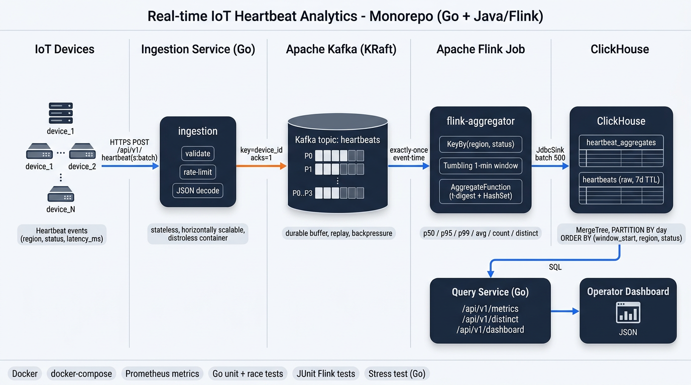

# counting-stream-with-flink

> Real-time IoT heartbeat analytics: **Go** ingestion + **Apache Kafka** buffer + **Apache Flink** stateful aggregation (t-digest **p50/p95/p99**, distinct device count) + **ClickHouse** OLAP storage + **Go** query API — all in a **monorepo**, packaged with **Docker Compose** for one-shot local / single-host deploys.

> Built pair-coding with **Claude** (Anthropic) through design, refactors, and tests.

---

## Architecture



Alternative detailed view with numbered data-flow steps: [`docs/img/system-design.png`](docs/img/system-design.png).

<details>
<summary>Text diagram (for terminals)</summary>

```
┌──────────────────────────────────────────────────────────────────────────────┐
│                            Docker Compose                                    │
│                                                                              │
│   IoT devices                                                                │
│       │   HTTPS POST /api/v1/heartbeat(s:batch)                              │
│       ▼                                                                      │
│   ┌─────────────┐          ┌────────────────┐                                │
│   │ ingestion   │─────────▶│     Kafka      │  topic: heartbeats             │
│   │  (Go :8080) │  key=    │  (KRaft :9092) │  partitions P0..Pn             │
│   └─────────────┘  device  └────────┬───────┘                                │
│                                     │ exactly-once consumer                  │
│                                     ▼                                        │
│                            ┌───────────────────┐                             │
│                            │ flink-aggregator  │  KeyBy(region,status)       │
│                            │   (Java :8082 UI) │  Tumbling 1-min window      │
│                            │                   │  t-digest + HashSet         │
│                            └────────┬──────────┘                             │
│                                     │ JdbcSink batch 500 / 1s                │
│                                     ▼                                        │
│   ┌──────────────┐         ┌───────────────────┐                             │
│   │ query (Go    │◀────────│   ClickHouse      │  heartbeat_aggregates       │
│   │  :8081)      │   SQL   │    :8123/:9000    │  heartbeats (raw 7d TTL)    │
│   └──────┬───────┘         └───────────────────┘                             │
│          │ JSON                                                              │
│          ▼                                                                   │
│   Operator dashboard                                                         │
└──────────────────────────────────────────────────────────────────────────────┘
```

</details>

---

## Key capabilities

| Area | What it does |
|---|---|
| **Ingestion** | Stateless Go HTTP service; JSON schema validation, body-size cap, batch + single endpoints; publishes to Kafka keyed by `device_id`. |
| **Streaming** | Flink job with event-time tumbling 1-min windows keyed by `(region, status)`; 30 s checkpoints on RocksDB plus `ReplacingMergeTree` dedup on the sink so a restart cannot double-count a window. |
| **Percentiles** | [t-digest](https://github.com/tdunning/t-digest) — mergeable, bounded memory, good accuracy for p50/p95/p99. |
| **Distinct count** | In-window `HashSet<device_id>` by default; drop-in swap for HLL when cardinality > ~100k. |
| **Storage** | ClickHouse tables: pre-aggregated `heartbeat_aggregates` (`ReplacingMergeTree`, 90 d TTL) + raw `heartbeats` (`MergeTree`, 7 d TTL), partitioned by day, ordered to match the dashboard filter. |
| **Query** | Go REST API: time-series (`/metrics`), distinct (`/distinct`), rolled-up operator dashboard (`/dashboard`) with count-weighted p95/p99. |
| **Tests** | Go unit + `-race`, Java JUnit for the aggregation logic, Go-based stress tool with RPS/latency report. |
| **Deploy** | `docker compose` — Kafka + ClickHouse + Flink JM/TM + both Go services + optional stress client; distroless production images. |

---

## Tech stack

| Layer | Choice |
|---|---|
| Ingestion / Query | **Go 1.22**, `net/http`, `log/slog`, distroless images |
| Streaming | **Apache Flink 1.18** (Java 17), Kafka source, JDBC sink, RocksDB state backend |
| Message bus | **Kafka 3.7** (KRaft mode — no ZooKeeper) |
| Storage | **ClickHouse 24.3** — `MergeTree`, `LowCardinality`, `DateTime64(3)` |
| Percentiles / distinct | **t-digest** 3.3 (Flink job), `HashSet<String>` — swappable HLL |
| Go Kafka client | **segmentio/kafka-go** 0.4 |
| Go CH client | **clickhouse-go/v2** 2.25 |
| Monorepo | Go workspace (`go.work`) + Maven module for the Flink job |

---

## Prerequisites

- **Docker** + **Docker Compose** v2 (required to run the full stack)
- **Go 1.22+** + **Maven 3.9+** + **JDK 17+** (only to build/run services outside Docker)

---

## Quick start

### One command to rule them all

```bash
./run-all.sh
```

This script: copies `.env.example` → `.env` if missing, brings the stack **up in detached mode** with a fresh **build**, waits for Kafka + ClickHouse to be healthy, submits the Flink job, and prints service URLs plus a ready-to-paste `curl` to send a heartbeat.

### Full stop + restart (fast reset)

```bash
./restart-all.sh
```

Runs `docker compose down` then `run-all.sh` (containers + networks; **volumes are kept** so Kafka offsets / ClickHouse data / Flink checkpoints survive). To also wipe volumes: `docker compose -f deployments/docker-compose.yml down -v` then `./run-all.sh`.

### Or manually

```bash
cp .env.example .env
docker compose --env-file .env -f deployments/docker-compose.yml up -d --build
docker compose --env-file .env -f deployments/docker-compose.yml exec flink-jobmanager \
    flink run -d /opt/flink/usrlib/flink-aggregator.jar
```

### Services

| Service | URL / endpoint |
|---|---|
| **Ingestion API** | [http://localhost:8080](http://localhost:8080) — `POST /api/v1/heartbeat`, `POST /api/v1/heartbeats:batch` |
| **Query API** | [http://localhost:8081](http://localhost:8081) — `GET /api/v1/metrics`, `/distinct`, `/dashboard` |
| **Flink UI** | [http://localhost:8082](http://localhost:8082) |
| **ClickHouse HTTP / Play** | [http://localhost:8123](http://localhost:8123) / [/play](http://localhost:8123/play) |
| **ClickHouse TCP** | `localhost:9000` |
| **Kafka** | `localhost:9092` (brokers advertise as `kafka:9092` inside Compose) |

### Stop everything

```bash
docker compose -f deployments/docker-compose.yml down        # keeps volumes
docker compose -f deployments/docker-compose.yml down -v     # wipes data
```

---

## Running locally (services only, without Docker for the app)

Only Kafka + ClickHouse need to run in Docker; the Go services read plain env vars.

```bash
docker compose --env-file .env -f deployments/docker-compose.yml up -d kafka clickhouse

export KAFKA_BROKERS=localhost:9092
export CLICKHOUSE_ADDRS=localhost:9000
go run ./services/ingestion/cmd/ingestion  &   # :8080
go run ./services/query/cmd/query          &   # :8081

# Build + run the Flink job:
cd services/flink-aggregator && mvn -B -DskipTests package
# Submit target/flink-aggregator-*.jar via the Flink UI at http://localhost:8082
```

---

## Sending and querying heartbeats

### Send a single heartbeat

```bash
curl -s -X POST http://localhost:8080/api/v1/heartbeat \
  -H 'Content-Type: application/json' \
  -d '{"device_id":"dev-1","region":"us-east","status":"ok",
       "timestamp_ms":'"$(date +%s%3N)"',"latency_ms":23.5}'
```

### Send a batch (up to 1000)

```bash
curl -s -X POST http://localhost:8080/api/v1/heartbeats:batch \
  -H 'Content-Type: application/json' \
  -d '{"heartbeats":[
    {"device_id":"dev-1","region":"us-east","status":"ok","timestamp_ms":'"$(date +%s%3N)"',"latency_ms":12.3},
    {"device_id":"dev-2","region":"eu-west","status":"warn","timestamp_ms":'"$(date +%s%3N)"',"latency_ms":88.1}
  ]}'
```

### Query the operator dashboard (last hour, us-east)

```bash
FROM=$(($(date +%s%3N) - 3600000)); TO=$(date +%s%3N)
curl -s "http://localhost:8081/api/v1/dashboard?from=$FROM&to=$TO&region=us-east" | jq
```

Response shape:

```json
{
  "filter": {"FromMs": 1714650000000, "ToMs": 1714653600000, "Region": "us-east"},
  "total_events": 182341,
  "distinct_devices": 9820,
  "avg_latency_ms": 18.7,
  "p95_latency_ms_weighted": 62.1,
  "p99_latency_ms_weighted": 181.4,
  "series": [ /* per-minute WindowAggregate rows */ ]
}
```

### Time-series + distinct

```bash
curl -s "http://localhost:8081/api/v1/metrics?from=$FROM&to=$TO&status=error&limit=500" | jq '.count'
curl -s "http://localhost:8081/api/v1/distinct?from=$FROM&to=$TO"                      | jq '.distinct_devices'
```

---

## Configuration

All config is **12-factor** — env vars. Defaults live in [`.env.example`](.env.example); `run-all.sh` / `make up` copies it to `.env` on first run.

| Group | Variable | Default | Purpose |
|---|---|---|---|
| **Kafka** | `KAFKA_BROKERS` | `kafka:9092` | Bootstrap servers for ingestion + Flink |
| | `KAFKA_TOPIC` | `heartbeats` | Topic name |
| | `KAFKA_GROUP` | `flink-aggregator` | Flink consumer group |
| | `KAFKA_BATCH_SIZE` | `1000` | Ingestion producer batch size |
| | `KAFKA_BATCH_TIMEOUT` | `20ms` | Ingestion producer linger |
| **ClickHouse** | `CLICKHOUSE_ADDRS` | `clickhouse:9000` | Native TCP for query service |
| | `CLICKHOUSE_DATABASE` | `default` | DB name |
| | `CLICKHOUSE_USER` / `CLICKHOUSE_PASSWORD` | `default` / `` | Credentials |
| | `CH_JDBC_URL` | `jdbc:clickhouse://clickhouse:8123/default` | HTTP JDBC for Flink sink |
| **Flink** | `WINDOW_SECONDS` | `60` | Tumbling window size (aggregation granularity) |
| | `ALLOWED_LATENESS_SEC` | `30` | Out-of-order tolerance on watermarks |
| **Ingestion** | `INGESTION_ADDR` | `:8080` | Listen addr |
| | `INGESTION_HOST_PORT` | `8080` | Host port mapping for compose |
| **Query** | `QUERY_ADDR` | `:8081` | Listen addr |
| | `QUERY_HOST_PORT` | `8081` | Host port mapping |
| **Stress** | `STRESS_TARGET`, `STRESS_RPS`, `STRESS_DURATION`, `STRESS_BATCH`, `STRESS_DEVICES` | see `.env.example` | Load test defaults |

### Scaling knobs

- **Ingestion** — stateless; scale horizontally behind a load balancer. Bump `KAFKA_BATCH_SIZE` + `KAFKA_BATCH_TIMEOUT` to amortise Kafka RTT on hot paths.
- **Kafka partitions** — increase the number of partitions on the `heartbeats` topic so Flink parallelism can scale with it. Ordering per `device_id` is preserved (key-hash partitioner).
- **Flink** — `taskmanager.numberOfTaskSlots` in `deployments/flink/flink-conf.yaml`; `parallelism.default` for the job. Add more `flink-taskmanager` replicas in compose if you need more slots.
- **Window size** — shrink `WINDOW_SECONDS` for fresher dashboards at the cost of more ClickHouse rows; raise it to smooth out spikes.

---

## Running the tests

### Go — unit + race + coverage

```bash
make test
```

Runs:

```bash
go test -race -count=1 -covermode=atomic -coverprofile=coverage.out \
  ./pkg/... ./services/ingestion/... ./services/query/... ./tests/stress/...
```

Covers **`pkg/model`** (validation rules), **`pkg/kafkax`** (fake producer + concurrency), **`pkg/chx`** (runner filters), **`services/ingestion`** (all HTTP paths, concurrent clients, context cancel propagation, metrics), **`services/query`** (filter parsing matrix, rollup math, empty-window safety), **`tests/stress/internal/load`** (the load generator itself, against an in-process ingestion mock).

### Java — Flink aggregation logic

```bash
cd services/flink-aggregator && mvn -B test
```

Validates **t-digest percentiles** on uniform 1..1000 (p50≈500, p95≈950, p99≈990 within 1%), **mean invariance under merge** (associativity), **distinct set correctness**, and the **JSON deserializer** (malformed payloads dropped).

### Stress test

```bash
make up && make submit-flink
make stress                                        # 5k rps × 60s × 10k devices
```

Or tune via flags:

```bash
go run ./tests/stress/cmd/stress \
  --target=http://localhost:8080 \
  --rps=20000 --duration=120s --workers=64 --batch=20 --devices=100000
```

#### Real run on a MacBook M-series (single-node compose stack)

Stress config: `--rps=3000 --duration=90s --workers=32 --batch=10 --devices=5000`, then a second 30s wave to advance the Flink watermark.

```text
---- stress report (ingestion HTTP) ----
sent        : 1,253,320
accepted    : 1,253,320
rejected    : 0
net errors  : 96          (0.007% - ctx cancel at shutdown, harmless)
avg latency : 22.9 ms
p50 latency : 22.5 ms
p95 latency : 26.0 ms
p99 latency : 31.2 ms
max latency : 81.0 ms
```

Over ~1.25M heartbeats, the ingestion service stayed well under 50 ms at p99 with a single container and acks=1. Errors are requests that raced the final context cancel — the producer-side retry handles these in a real deployment.

After the Flink windows close and flush, `heartbeat_aggregates` contains 4 regions × 3 statuses × N minutes rows. A `SELECT region, status, sum(count)…` rollup confirms:

| region | status | events | peak unique | avg ms | p95 ms | p99 ms |
|---|---|---:|---:|---:|---:|---:|
| ap-south | ok    | 187,745 | 5,000 | 32.3 | 64.1 | 455.7 |
| ap-south | warn  |  62,567 | 4,998 | 31.5 | 63.8 | 273.1 |
| ap-south | error |  62,988 | 4,999 | 32.2 | 64.5 | 452.0 |
| eu-west  | ok    | 188,172 | 5,000 | 32.5 | 64.4 | 378.3 |
| us-east  | ok    | 188,168 | 5,000 | 38.2 | 72.6 | 327.7 |
| us-west  | ok    | 188,430 | 5,000 | 32.2 | 64.0 | 362.5 |
| … | … | … | … | … | … | … |

Interpretation:

- `ok` rows are ~3× warn/error — matches the 3:1:1 status weighting the load generator emits.
- `peak unique` per (region, status) saturates at the `--devices` pool (5,000) for `ok`, lower for warn/error because those get less traffic and thus fewer unique hits per minute.
- `p50 ≈ 14 ms`, `avg ≈ 32 ms`, `p99 ≈ 300–560 ms` matches the generator's latency shape: exponential with mean 20 ms plus a 1 % fat tail spike of 500–2000 ms. t-digest captures the tail without keeping raw samples.

As a container on the same compose network:

```bash
docker compose --env-file .env -f deployments/docker-compose.yml \
    --profile stress up --build stress
```

### End-to-end sanity check

After `./run-all.sh`:

```bash
go run ./tests/stress/cmd/stress --duration=90s --rps=3000 --batch=10
# Flush the last open window by sending a few fresh events AFTER the stress
# stops so the watermark can advance past it:
for i in 1 2 3; do
  curl -s -X POST http://localhost:8080/api/v1/heartbeat \
    -H 'Content-Type: application/json' \
    -d '{"device_id":"ping-'$i'","region":"us-east","status":"ok",
         "timestamp_ms":'"$(python3 -c 'import time;print(int(time.time()*1000))')"',
         "latency_ms":1}' ; done
sleep 70                                           # window close + sink flush
FROM=$(python3 -c "import time;print(int(time.time()*1000)-300000)")
TO=$(python3 -c "import time;print(int(time.time()*1000))")
curl -s "http://localhost:8081/api/v1/dashboard?from=$FROM&to=$TO" \
  | jq '.total_events, .p95_latency_ms_weighted, .p99_latency_ms_weighted'
```

You should see non-zero totals and realistic p95/p99 latencies.

> Why the extra `ping` events? Flink uses **event-time** watermarks (`max(event_time) − 30s`). When the stress stops, the watermark stops advancing, so the last open window never closes. In a real IoT fleet this never happens because devices heartbeat continuously; for lab runs, a few fresh events push the watermark past the window boundary and flushes it to ClickHouse.

---

## Operations

The system surfaces data at four layers — pick the one that matches the
question you're asking.

| Layer | Where | Use for |
|---|---|---|
| Application API | `http://localhost:8081/api/v1/…` | Operator dashboards, SLO queries |
| ClickHouse Play | `http://localhost:8123/play` | Ad-hoc SQL in a browser, no client needed |
| ClickHouse CLI / HTTP | `docker compose exec clickhouse …` / `curl :8123/?query=…` | Scripts, CI, Grafana datasource |
| Flink UI / REST | `http://localhost:8082` / `/jobs/…` | Streaming job health, backpressure, checkpoints |

### Viewing ClickHouse metrics

#### 1. Built-in Play UI (browser)

Open **<http://localhost:8123/play>**. No auth (compose uses empty password). Paste SQL and hit `Run`:

```sql
-- Fleet rollup, last 30 minutes.
-- FINAL collapses any duplicate windows from a Flink retry. Omit it for
-- ~2x speed if you are OK with occasional duplicates post-restart.
SELECT
    region,
    status,
    sum(count)                       AS events,
    max(distinct_count)              AS peak_unique_devices,
    round(avg(avg_latency), 1)       AS avg_ms,
    round(avg(p95_latency), 1)       AS p95_ms,
    round(avg(p99_latency), 1)       AS p99_ms
FROM heartbeat_aggregates FINAL
WHERE window_start > now() - INTERVAL 30 MINUTE
GROUP BY region, status
ORDER BY events DESC;
```

```sql
-- Time-series for charting, one point per minute per region
SELECT window_start, region, sum(count) AS c, avg(p99_latency) AS p99
FROM heartbeat_aggregates FINAL
WHERE window_start > now() - INTERVAL 1 HOUR
GROUP BY window_start, region
ORDER BY window_start;
```

#### 2. CLI

```bash
docker compose -f deployments/docker-compose.yml exec clickhouse \
  clickhouse-client -q \
  "SELECT formatDateTime(window_start,'%H:%i:%S') AS win, region, status,
          count, distinct_count,
          round(avg_latency,1), round(p95_latency,1), round(p99_latency,1)
   FROM heartbeat_aggregates FINAL
   WHERE window_start > now() - INTERVAL 10 MINUTE
   ORDER BY window_start DESC, region, status LIMIT 20
   FORMAT PrettyCompactMonoBlock"
```

Interactive session (handy when exploring):

```bash
docker compose -f deployments/docker-compose.yml exec clickhouse clickhouse-client
# then: SHOW TABLES; DESCRIBE heartbeat_aggregates; …
```

#### 3. HTTP API — good for Grafana, Metabase, Python, curl

```bash
curl -s 'http://localhost:8123/?query=SELECT%20count()%20FROM%20heartbeat_aggregates&FORMAT=JSON' | jq
```

Available formats: `JSON`, `JSONCompact`, `CSV`, `TSV`, `Pretty`, `Parquet`, `Arrow`, …

A Grafana ClickHouse datasource pointed at `http://clickhouse:8123` can drive dashboards directly from these tables — see the query in §Extending.

#### 4. ClickHouse-of-ClickHouse (system tables)

```bash
# Storage size per table
docker compose -f deployments/docker-compose.yml exec -T clickhouse \
  clickhouse-client -q \
  "SELECT name, formatReadableSize(total_bytes) AS size, total_rows AS rows
   FROM system.tables WHERE database='default' AND name LIKE 'heartbeat%'
   FORMAT PrettyCompactMonoBlock"

# Slowest queries in the last 10 min
docker compose -f deployments/docker-compose.yml exec -T clickhouse \
  clickhouse-client -q \
  "SELECT event_time, round(query_duration_ms,1) AS ms,
          formatReadableSize(memory_usage) AS mem, read_rows,
          substring(query,1,60) AS preview
   FROM system.query_log
   WHERE event_time > now() - INTERVAL 10 MINUTE AND type='QueryFinish'
   ORDER BY query_duration_ms DESC LIMIT 10 FORMAT PrettyCompactMonoBlock"
```

Other useful system tables: `system.metrics` (live counters), `system.events` (cumulative), `system.parts` (MergeTree parts — diagnose compaction), `system.asynchronous_metrics` (memory, disk, FD usage).

### Viewing the Flink job

#### 1. Flink Web UI — <http://localhost:8082>

- **Overview**: job graph, parallelism, backpressure % per operator.
- **Click on a job** → tabs:
  - **Overview** — records in/out per vertex, live throughput.
  - **Exceptions** — full stack trace of any failure, including the whole history of restarts.
  - **Checkpoints** — should show `COMPLETED` every 30 s. If you see `FAILED` or duration keeps growing, the sink is the bottleneck.
  - **Configuration** — effective job config (watermarks, parallelism, state backend).
- **TaskManagers** (top nav) → per-TM heap usage, network buffer pool.

> Troubleshooting heuristic: if the **source** shows high `Backpressured (max)`, the downstream operator (usually the sink) is slow. In our pipeline the JDBC ClickHouse sink batches 500 rows every 1 s, which is very light — backpressure only appears during bursty replay.

#### 2. Flink REST API

Scriptable — good for smoke tests and observability:

```bash
# list jobs
curl -s http://localhost:8082/jobs | jq

# job detail (vertex-level metrics)
JOB=$(curl -s http://localhost:8082/jobs | jq -r '.jobs[0].id')
curl -s "http://localhost:8082/jobs/$JOB" | jq \
  '{state, vertices:[.vertices[] | {name, status, records_in: .metrics."read-records", records_out: .metrics."write-records"}]}'

# exception history (most useful debug endpoint)
curl -s "http://localhost:8082/jobs/$JOB/exceptions" | jq '.exceptionHistory.entries[0].stacktrace'

# per-vertex subtask metrics (source lag, sink latency, …)
VERT=$(curl -s "http://localhost:8082/jobs/$JOB" | jq -r '.vertices[0].id')
curl -s "http://localhost:8082/jobs/$JOB/vertices/$VERT/subtasks/metrics" | jq
```

Cancel / submit / savepoint via REST or CLI:

```bash
# cancel
curl -s -X PATCH "http://localhost:8082/jobs/$JOB?mode=cancel"

# re-submit (inside JM container)
docker compose -f deployments/docker-compose.yml exec flink-jobmanager \
  flink run -d /opt/flink/usrlib/flink-aggregator.jar
```

#### 3. Kafka consumer lag (the upstream side)

```bash
docker compose -f deployments/docker-compose.yml exec -T kafka \
  /opt/kafka/bin/kafka-consumer-groups.sh --bootstrap-server localhost:9092 \
  --describe --group flink-aggregator
```

Look at the `LAG` column — if it grows, Flink is falling behind the producers.

### Peek at raw Kafka messages

```bash
docker compose -f deployments/docker-compose.yml exec kafka \
    /opt/kafka/bin/kafka-console-consumer.sh --bootstrap-server localhost:9092 \
    --topic heartbeats --from-beginning --max-messages 5
```

### Describe the `heartbeats` topic

```bash
docker compose -f deployments/docker-compose.yml exec kafka \
    /opt/kafka/bin/kafka-topics.sh --bootstrap-server localhost:9092 \
    --describe --topic heartbeats
```

### Tail service logs

```bash
make logs                                          # all services
docker compose -f deployments/docker-compose.yml logs -f ingestion
docker compose -f deployments/docker-compose.yml logs -f flink-taskmanager
```

---

## Project structure

```
counting-stream-with-flink/
├── run-all.sh                      # compose up -d --build + submit-flink + hints
├── restart-all.sh                  # compose down → run-all.sh (keeps volumes)
├── Makefile
├── .env.example                    # 12-factor config template
├── docs/img/architecture.png
├── docs/img/system-design.png
│
├── go.work                         # Go workspace (4 modules)
├── pkg/                            # shared Go libraries
│   ├── model/    heartbeat + aggregate wire types, validation
│   ├── kafkax/   Kafka producer + in-memory fake for tests
│   └── chx/      ClickHouse client + QueryRunner interface + fake
│
├── services/
│   ├── ingestion/                  # Go HTTP API
│   │   ├── cmd/ingestion/main.go
│   │   ├── internal/server/        # handlers + unit tests
│   │   └── Dockerfile
│   ├── query/                      # Go dashboard API
│   │   ├── cmd/query/main.go
│   │   ├── internal/server/        # handlers + unit tests
│   │   └── Dockerfile
│   └── flink-aggregator/           # Java/Maven module
│       ├── pom.xml
│       ├── src/main/java/…/AggregatorJob.java
│       ├── src/test/java/…         # JUnit tests
│       └── Dockerfile              # builds the shaded job jar
│
├── tests/stress/                   # Go load generator (CLI + lib + tests)
│   ├── cmd/stress/main.go
│   ├── internal/load/generator.go
│   └── Dockerfile
│
├── deployments/
│   ├── docker-compose.yml          # full stack with healthchecks
│   ├── clickhouse/init/01_schema.sql
│   └── flink/flink-conf.yaml
│
└── .github/workflows/ci.yml
```

---

## Continuous Integration

GitHub Actions pipeline in [`.github/workflows/ci.yml`](.github/workflows/ci.yml) runs on every push to `main` and on every pull request:

- **`go-test`** — Go 1.22 + module cache, `go vet`, `go test -race -count=1 -covermode=atomic` across all four modules; uploads `coverage.out` as an artifact.
- **`java-test`** — JDK 17 + Maven cache, `mvn -B -ntp verify` on the Flink aggregator (builds the shaded job jar and runs JUnit 5 tests); uploads the jar and Surefire reports.
- **`compose-validate`** — `docker compose config --quiet` catches syntax / interpolation errors in `docker-compose.yml`.
- **`smoke`** — boots Kafka + ClickHouse in Compose, runs `ingestion` and `query` natively, sends a heartbeat, probes `/healthz`, dumps logs on failure, always tears the stack down.

Run the same checks locally:

```bash
make test                                          # go vet + race + coverage
cd services/flink-aggregator && mvn -B verify      # java tests + shaded jar
docker compose --env-file .env.example \
    -f deployments/docker-compose.yml config --quiet
```

---

## Extending

- **Add a new tag (e.g. `device_model`)** — update `pkg/model.Heartbeat`, the Flink `Heartbeat` POJO, the ClickHouse schema, the Flink key selector, and the query filter in `pkg/chx/client.go`. All validation lives in `pkg/model`, nowhere else.
- **HLL for distinct count** — swap `Set<String> devices` in `AggregateAccumulator` for [`stream-lib`](https://github.com/addthis/stream-lib) `HyperLogLog`; serialize the state and store it in ClickHouse as `AggregateFunction(uniqHLL12, String)`, merging at query time.
- **Prometheus metrics** — replace the inline atomic counters in `services/ingestion` with `prometheus/client_golang` and expose `/metrics` in Prom format.
- **Managed Kafka / ClickHouse** — services are 12-factor; point `KAFKA_BROKERS` / `CLICKHOUSE_ADDRS` at your managed cluster and drop the dev services from compose.

---

## Acknowledgements

Codebase pair-coded with **Claude** (Anthropic) for design, implementation, and test coverage. README format inspired by [`lamthao1995/crawl-news-system`](https://github.com/lamthao1995/crawl-news-system).

---

## License

[ISC](LICENSE) © 2026 Pham Ngoc Lam.
